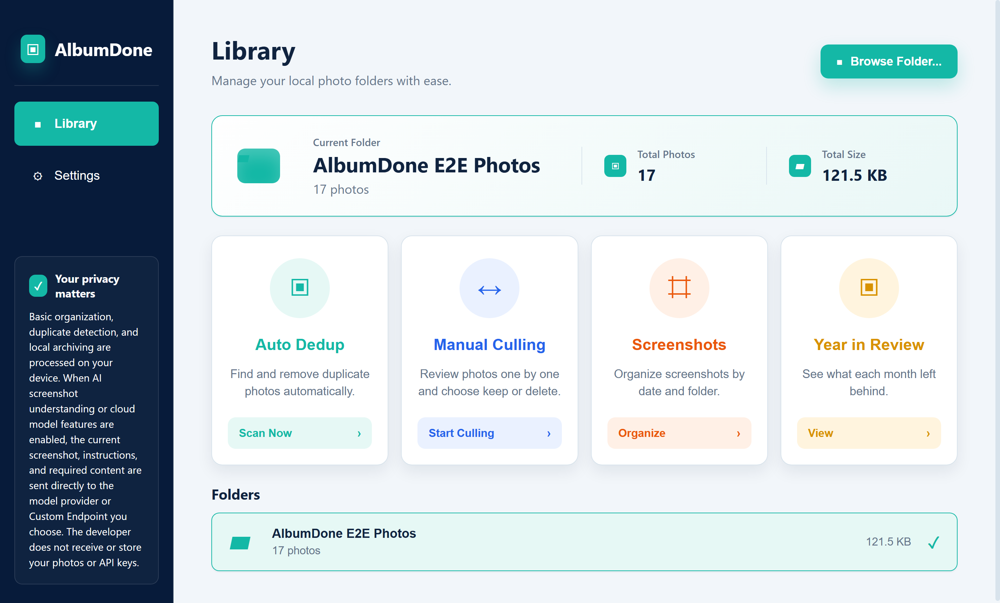

[English](README.md) | [简体中文](README.zh-CN.md)

# AlbumDone

[](https://github.com/BlueVenn6/AlbumDone/actions/workflows/ci.yml)
[](https://github.com/BlueVenn6/AlbumDone/actions/workflows/codeql.yml)
[](LICENSE)

AlbumDone is an open-source, local-first Windows photo organizer for duplicate review, manual culling, screenshot workflows, and year-in-review collages, with optional bring-your-own-key AI assistance.

The public release is a Windows desktop Beta. Android and iOS builds are being tested separately and are not publicly available from this repository.

## Product Preview



The screenshot above is produced by the Electron production test with a synthetic photo library. It contains no user photos or private paths.

## What AlbumDone Solves

Large local photo folders are difficult to review consistently. AlbumDone brings common cleanup tasks into one desktop application while keeping file selection and deletion decisions visible to the user.

## Core Features

- **Duplicate review:** scan exact and visually similar candidates, then review each group before selecting files for deletion.
- **Manual culling:** review photos individually or in a grid, mark keep/delete decisions, and undo changes before confirmation.
- **Screenshot workflow:** identify screenshot candidates, browse them, and optionally run text extraction, translation, summarization, rewriting, or custom instructions.
- **Year in Review:** create a collage for the current year or the past 12 months, with explicit localized cards for months without usable photos.
- **Optional BYO-key AI:** configure supported providers or a trusted Custom Endpoint with your own API key. AI is not required for local folder organization.

Similarity is a review aid, not proof that two files are interchangeable. AlbumDone does not make an automatic deletion decision on the user's behalf.

## Local-First and Privacy

Folder scanning, thumbnailing, duplicate analysis, culling, and collage generation run on the user's device. AlbumDone does not provide a shared photo-storage backend, and the project maintainer does not receive local photos or API keys through these workflows.

AI features are optional and are not fully offline. When the user explicitly runs an AI action, the selected screenshot, the instruction, and required request content are sent directly to the model provider or Custom Endpoint chosen by the user. The provider's privacy terms, availability, and usage charges apply.

Desktop API keys are stored with system-backed secure storage such as keytar or Electron `safeStorage`. Never include a key in an issue, screenshot, Base URL query parameter, log, or pull request.

## Download

Beta builds are available from [GitHub Releases](https://github.com/BlueVenn6/AlbumDone/releases). Download the Windows `.exe` asset, not GitHub's automatically generated source archives.

Current public target:

- Windows 10 or Windows 11 on Intel/AMD x64: native support.
- Windows 11 ARM64: runs through Windows x64 emulation; the release is not ARM64-native.
- Windows 10 ARM64, 32-bit Windows, Android, and iOS: no public build is currently provided.

The current Windows installer is not code-signed yet. Windows SmartScreen may display a warning.

## Installation

1. Open the [Releases page](https://github.com/BlueVenn6/AlbumDone/releases) and select the latest Beta.
2. Download the asset whose filename ends in `-x64.exe`.
3. If `SHA256SUMS.txt` is attached, verify the installer in PowerShell:

   ```powershell
   Get-FileHash -Algorithm SHA256 .\AlbumDone-*.exe
   ```

4. Compare the result with the checksum attached to the same Release.
5. Run the installer and follow the prompts. For an unsigned build, only continue after confirming the file came from this repository and its checksum matches.

See the [bilingual user guide](docs/USER_GUIDE.md) for workflow instructions.

## Current Beta Status

The source version is **v0.1.2-beta.4**. This Beta includes the current desktop provider compatibility fixes, dependency security updates, release source fingerprinting, production Electron workflow tests, reproducible performance checks, and crash isolation for visual hashing in large photo libraries.

Beta means the application is still being tested across more libraries and Windows environments. A successful automated test does not remove the need to review file operations in your own environment.

## Safety Notice

- Start with a copied test folder or a fully backed-up photo library.
- Review every duplicate or similar-photo group before confirming deletion.
- Do not treat visual similarity as a safe-delete decision.
- Confirm the selected folder, photo count, and deletion candidates before a batch operation.
- Deletion prefers the Windows Recycle Bin and may use an app-managed fallback trash directory when necessary, but recovery is not guaranteed in every environment.
- AI output may be incomplete or incorrect. Review it before using or sharing it.

See [DISCLAIMER.md](DISCLAIMER.md) for the complete safety and third-party service notice.

## Known Limitations

- The Windows installer is currently unsigned and may trigger SmartScreen.
- Large-library performance depends on image format, disk speed, decoder support, and available memory.
- Damaged, offline, locked, or unsupported images may be skipped and reported.
- Cloud model access depends on the selected provider, account permissions, model availability, quota, and network access.
- The current x64 build is not an ARM64-native application.
- Mobile editions have not completed separate public release acceptance and are not available here.

## Feedback and Bug Reports

Use [GitHub Issues](https://github.com/BlueVenn6/AlbumDone/issues) for reproducible bugs and feature requests. Include the AlbumDone version, Windows version, workflow, displayed counts, and steps to reproduce. Do not attach private photos, API keys, credentials, or sensitive local paths.

Security reports should follow [SECURITY.md](SECURITY.md).

## Development

Prerequisites: Node.js 22 and npm 10.

```bash
npm install
npm run lint
npm run typecheck
npm run test
npm run build
```

Run the desktop app in development:

```bash
npm run dev:desktop
```

Create a clean, traceable Windows installer:

```bash
npm --workspace @photo-manager/desktop run package
```

The packaging command cleans generated Shared/Desktop outputs, rebuilds Shared before Desktop, embeds a source fingerprint, and creates one uniquely named NSIS installer. Default development ports and optional local services are documented in [.env.example](.env.example).

Additional documentation:

- [User guide](docs/USER_GUIDE.md)
- [Reproducible performance benchmarks](docs/PERFORMANCE.md)
- [Code-signing policy](CODE_SIGNING_POLICY.md)

## Contributing

Before opening a pull request, run the checks above and describe how the change was tested. Keep changes focused, add regression coverage for bug fixes, and never commit user data, API keys, generated installers, or local configuration.

## License

AlbumDone is released under the [MIT License](LICENSE).
