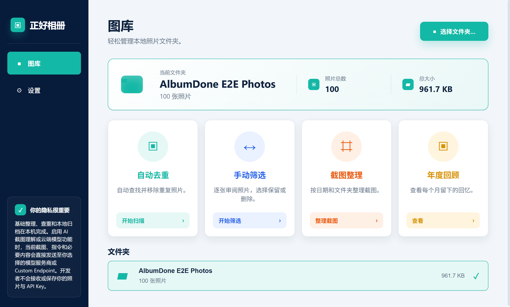

[English](README.md) | [简体中文](README.zh-CN.md)

# AlbumDone

[](https://github.com/BlueVenn6/AlbumDone/actions/workflows/ci.yml)
[](https://github.com/BlueVenn6/AlbumDone/actions/workflows/codeql.yml)
[](LICENSE)

AlbumDone 是一款开源、本地优先的 Windows 照片整理工具，提供重复照片审核、人工筛选、截图整理和年度回顾拼图，并支持可选的自备 API Key AI 辅助功能。

当前公开版本是 Windows 桌面测试版。Android 和 iOS 版本仍在单独测试，尚未通过本仓库公开发布。

## 产品截图



上图由 Electron 生产环境测试使用合成图库生成，不包含用户照片或私人路径。

## AlbumDone 解决什么问题

大型本地照片文件夹往往难以持续、清楚地审核。AlbumDone 把常见的整理任务集中到一个桌面应用中，同时让用户始终能够看到文件选择和删除决定。

## 核心功能

- **重复照片审核：** 扫描完全重复和视觉相似候选，用户逐组审核后再选择需要删除的文件。
- **人工筛选：** 以单张或网格方式审核照片，标记保留/删除，并可在确认前撤销操作。
- **截图工作流：** 识别截图候选、浏览截图，并可选择执行文字提取、翻译、总结、改写或自定义指令。
- **年度回顾：** 生成当前年份或过去 12 个月的拼图；没有可用照片的月份使用明确且跟随界面语言的占位卡片。
- **可选的自备 Key AI：** 使用自己的 API Key 配置支持的提供商或可信 Custom Endpoint。本地文件夹整理不依赖 AI。

相似度结果只用于辅助审核，不能证明两个文件可以互相替代。AlbumDone 不会替用户自动作出删除决定。

## 本地优先与隐私

文件夹扫描、缩略图、重复分析、人工筛选和拼图生成都在用户设备上运行。AlbumDone 不提供共享照片存储后端；在这些本地流程中，项目维护者不会收到用户的本地照片或 API Key。

AI 功能是可选的，并非完全离线。只有用户明确执行 AI 操作时，当前选中的截图、指令和请求所需内容才会直接发送到用户选择的模型提供商或 Custom Endpoint。相应提供商的隐私条款、可用性和使用费用仍然适用。

桌面端 API Key 使用 keytar 或 Electron `safeStorage` 等系统安全存储。不要在 Issue、截图、Base URL 查询参数、日志或 Pull Request 中提交密钥。

## 下载

测试版本可从 [GitHub Releases](https://github.com/BlueVenn6/AlbumDone/releases) 下载。请选择 Windows `.exe` 附件，不要把 GitHub 自动生成的源代码压缩包当成安装程序。

当前公开目标平台：

- Intel/AMD x64 电脑上的 Windows 10 或 Windows 11：原生支持。
- Windows 11 ARM64：通过 Windows x64 模拟运行；当前版本不是 ARM64 原生应用。
- Windows 10 ARM64、32 位 Windows、Android 和 iOS：目前没有公开构建。

当前 Windows 安装程序尚未进行代码签名，因此 Windows SmartScreen 可能会显示安全提示。

## 安装

1. 打开 [Releases 页面](https://github.com/BlueVenn6/AlbumDone/releases)，选择最新 Beta。
2. 下载文件名以 `-x64.exe` 结尾的附件。
3. 如果 Release 附有 `SHA256SUMS.txt`，请在 PowerShell 中校验安装程序：

   ```powershell
   Get-FileHash -Algorithm SHA256 .\AlbumDone-*.exe
   ```

4. 将结果与同一 Release 附带的校验值比较。
5. 运行安装程序并按提示操作。对于未签名版本，只有在确认文件来自本仓库且校验值一致后才继续安装。

具体工作流请参阅[中英双语使用指南](docs/USER_GUIDE.md)。

## 当前测试状态

当前源码版本为 **v0.1.2-beta.3**。该测试版包含当前桌面模型提供商兼容性修复、依赖安全更新、发布源码指纹、Electron 生产工作流测试和可复现性能检查。

Beta 表示应用仍在更多图库和 Windows 环境中接受测试。自动测试成功并不替代用户在自己的环境中审核文件操作。

## 安全提示

- 首先使用复制出来的测试文件夹，或已经完整备份的照片图库。
- 确认删除前，逐组审核所有重复或相似照片。
- 不要把视觉相似结果直接当作安全删除决定。
- 批量操作前确认当前文件夹、照片数量和删除候选。
- 删除优先使用 Windows 回收站，必要时可能使用应用管理的备用回收目录；并非所有环境都能保证恢复。
- AI 输出可能不完整或不准确，使用或分享前必须审核。

完整安全和第三方服务说明请参阅 [DISCLAIMER.md](DISCLAIMER.md)。

## 已知限制

- Windows 安装程序目前尚未签名，可能触发 SmartScreen。
- 大型图库性能取决于图片格式、磁盘速度、解码器支持和可用内存。
- 损坏、离线、被锁定或无法解码的图片可能被跳过并报告。
- 云端模型访问取决于提供商、账号权限、模型可用性、配额和网络环境。
- 当前 x64 构建不是 ARM64 原生应用。
- 移动端尚未完成独立的公开发布验收，本仓库不提供移动端下载。

## 反馈与问题报告

请通过 [GitHub Issues](https://github.com/BlueVenn6/AlbumDone/issues) 提交可复现问题和功能建议，并注明 AlbumDone 版本、Windows 版本、使用的工作流、显示数量和复现步骤。不要附加私人照片、API Key、凭据或敏感本地路径。

安全问题请按照 [SECURITY.md](SECURITY.md) 报告。

## 本地开发

前置环境：Node.js 22 和 npm 10。

```bash
npm install
npm run lint
npm run typecheck
npm run test
npm run build
```

以开发模式运行桌面应用：

```bash
npm run dev:desktop
```

创建干净且可追溯的 Windows 安装程序：

```bash
npm --workspace @photo-manager/desktop run package
```

打包命令会清理自动生成的 Shared/Desktop 输出，先重新构建 Shared，再构建 Desktop，嵌入源码指纹，并生成一个具有唯一名称的 NSIS 安装程序。默认开发端口和可选本地服务记录在 [.env.example](.env.example) 中。

更多文档：

- [使用指南](docs/USER_GUIDE.md)
- [可复现性能基准](docs/PERFORMANCE.md)
- [代码签名政策](CODE_SIGNING_POLICY.md)

## 参与贡献

提交 Pull Request 前，请运行上述检查并说明测试方法。改动应保持聚焦，Bug 修复应增加回归覆盖；不要提交用户数据、API Key、生成的安装程序或本地配置。

## 许可证

AlbumDone 使用 [MIT License](LICENSE) 发布。
